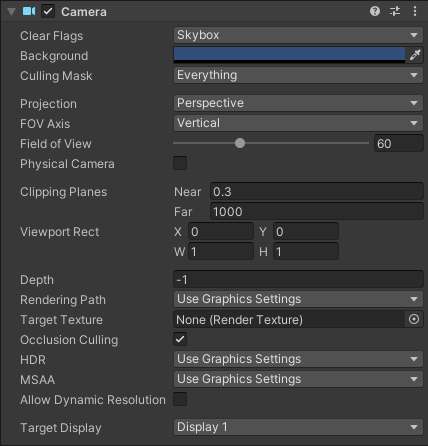
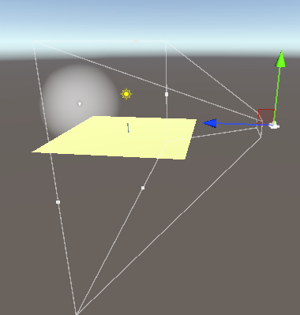
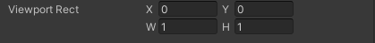
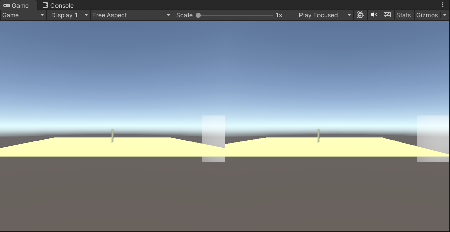
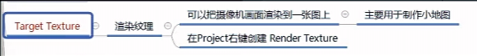
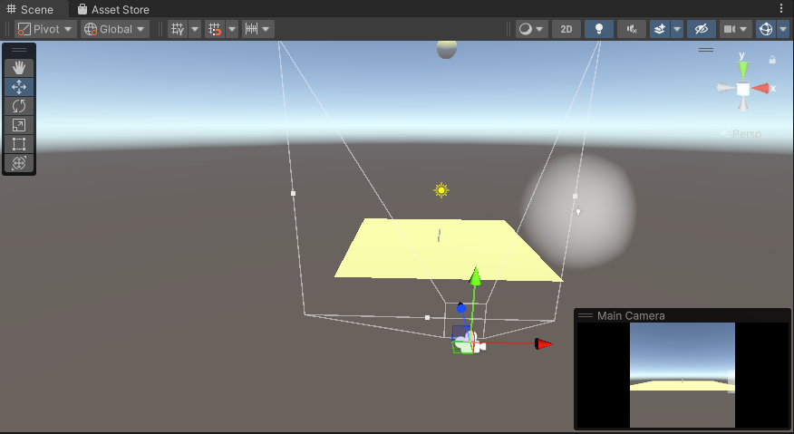

# Camera

相机主要可以分为主相机和其他相机；

	主相机可以直接使用 Camera.main 获得；

	其他相机只能 :

```c#
        Camera[] cameras = new Camera[Camera.allCamerasCount];
        Camera.GetAllCameras(cameras);
```

## 相机的Inspect：

​​

### Clear Flags:

	清理标志：SkyBox表示天空盒，效果会覆盖低层相机的所有值

			  Depth only 效果渲染自己的层级，其余背景变透明，相机层一般较高，常用于多个相机显示中，保留其他相机显示，同时将自己渲染的对象加入到画面中。

### **Culling Mask：**

	**剔除掩码：** 用于剔除自己不渲染的层级，Evething代表全部渲染，一般为 11111111.... 不渲染的层级设为 0；

### **Projection：**

	 **📽️投影：** Perspective 用于3D投影，物体会呈现近大远小；

					FOV Axis、Field of View 是3D投影特有的参数：（ FOV Axis 代表 水平或垂直轴） （Field of View 代表 该轴的长度）

			Orthographic 用于2D投影，物体大小无视深度；

					Size 是 2D的参数，表示显示区域的大小；

### Clipping Planes ：

	相机的显示其实是在两个平面中间的是一个梯形立方体，Near代表近平面，Far代表远平面，小于Near 或 大于Far 相机不渲染；

​​

### Viewport Rect：

​​

用于两个相机显示时分屏：

​​

‍

### Depth：

	相机所在的层数，如果相机 Clear Flag 同为 SkyBox ，高层的相机会覆盖低层相机的显示，一般高层相机会配合 Depth Only使用；

‍

### Target Texture:

		在Project窗口新建 Render Texture，得到 New Render Texture 然后将其关联到 Target Texture 中，相机的显示就会被缩小，同时显示在右下角；

	​

‍

​​

‍

### Occlusion Culling:

	遮挡剔除：开启后，被遮挡的物体，将不会被渲染。

‍

## Camera的代码：

	从世界坐标转移到屏幕坐标：

		Vector3 v = Camera.main.WorldToScreenPoint(v3);

	从屏幕坐标转换到世界：

```c#
      	\\获得鼠标的屏幕坐标
		Vector3 v3 = Input.mousePosition;
        Debug.Log(v3);
		\\屏幕坐标，默认Z为0，需要设置Z，否则，当Z为0，世界坐标只有一个点（参考投影的原理）
        v3.z = 10.0f;
		\\坐标变换
        Vector3 v = Camera.main.ScreenToWorldPoint(v3);
		
		\\鼠标左键，在转换的坐标上生成一个球，
        if (Input.GetMouseButtonDown(0))
            GameObject.CreatePrimitive(PrimitiveType.Sphere).transform.position = v;
```
