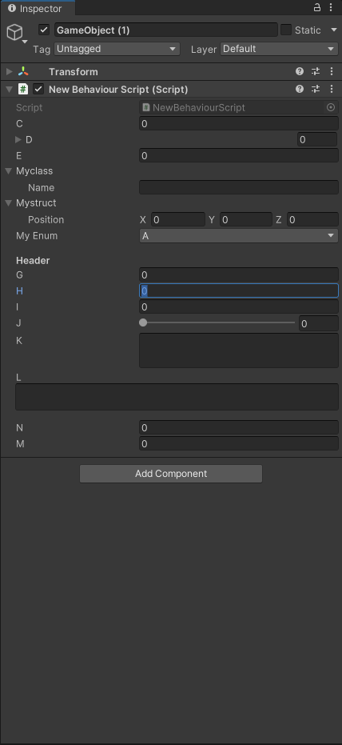

# Inspect可编辑变量

**显示与编辑**

		一、***私有变量无法显示：字段前添加特性***   ***[SerializeField]***  ***可以强制显示私有字段，在窗口中赋值相当于初始化。***

		二、***公有变量默认可以编辑，字段前添加特性***   ***[HideInInspect]***  ***可以强制隐藏。***

		三、***大部分变量（枚举，列表，GameObject类等）可以被显示，字典，自定义类型（struct，自定义类）不能被显示，***

			***自定义类可以通过添加***   ***[System.Serializable]*** 

		***四、辅助特性liza***

			1、[Header("xxx")] 分组特性

			2、[Tooltip("xxx")] 悬浮提示

			3、[Space] 显示空行

			4、 [Range(min,max)] 滑块

			5、[Multiline] 多行显示ContextMenuItem

			6、[TexArea(min,max)] 文本滚动块

			7、[ContextMenuItem（“窗口中显示的名字”，“无参无返回方法名”）] 为变量添加快捷方法

			8、[Context'Menu] 在方法前添加，是其可以在窗口中调用

```c#
[System.Serializable]
public struct Mystruct
{
    public Vector3 Position;
}

public struct Mystruct2
{
    public Vector3 Position;
}

[System.Serializable]
public class Myclass
{
    public string name;
}

public class NewBehaviourScript : MonoBehaviour
{
    //普通private无法显示在Inspector面板
    private int a = 0;
    private List<int> b = new List<int>();

    //Add attribute[SerializeField] 可以显示在Inspector面板
    [SerializeField]
    private int c = 0;
    [SerializeField]
    private List<int> d = new List<int>();

    //Add attribute[HideInInspector] 可以隐藏在Inspector面板
    public int e = 0;

    [HideInInspector]
    public int f = 0;

    //Add attribute[System.Serializable] 可以显示在Inspector面板
    public Myclass myclass = new Myclass();
    public Mystruct mystruct = new Mystruct();
    public Mystruct2 mystruct2 = new Mystruct2();
	
	//分组
    [Header("Header")]
    public float g = 0.0f;
    public float h = 0.0f;
	
	//悬浮提示
    [Tooltip("Tooltip")]
    public float i = 0.0f;
	
	//滑块
    [Range(0, 10)]
    public float j = 0.0f;
	
	//多行
    [Multiline(3)]
    public string k = "";
	
	//文本块滑块
    [TextArea(2, 4)]
    public string l = "";
	
	//空行
    [Space(10)]
    public float n = 0.0f;
	//变量上设置悬浮选项，点击选项调用方法，ContextMenuItem（选项名，方法名）
    [ContextMenuItem("Do Something2", "DoSomething2")]
    public float m = 0.0f;

    [ContextMenu("Do Something")]
    void DoSomething()
    {
        Debug.Log("Perform operation");
    }

    public void DoSomething2()
    {
        m = 1.0f;
    }
```

**示例**

​​

‍

‍

<span data-type="text" style="font-size: 48px;">🤪</span>

***注！运行中的修改的变量不被保存，如果需要保存 鼠标移到脚本上点击***  *Copy Compoment* ***运行完成后点击***  *Patse Compoment*

‍
