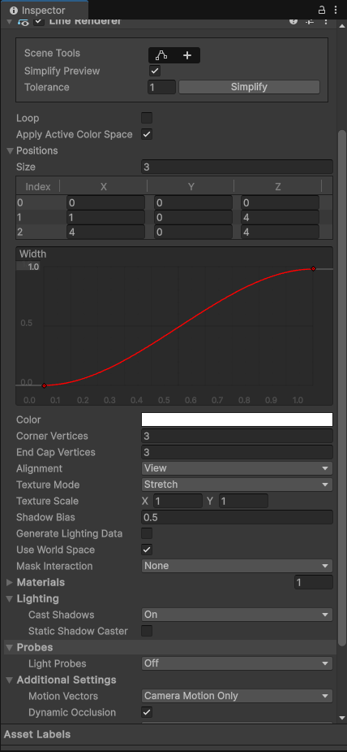

# LineRender

## Inspect窗口：

​​

Scene Tool：1、编辑模式，方便编辑线；2、添加点、可以简易的添加点；

Simplify preview：可以看到线的纯轨迹；

Loop：是否首尾相连

Position：点的个数与位置；

Width：线的宽度，首尾宽度可以不一样；

Generate Lighting Data：与材质有关，当材质收光照影响，需要勾选；

Use World Space：是否使用世界坐标系；

Materials：线的材质；

‍

## 代码：

```c#
        #region 知识点三 LineRender代码相关
        //动态添加一个线段
        GameObject line = new GameObject();
        line.name = "Line";
        LineRenderer lineRenderer = line.AddComponent<LineRenderer>();

        //首尾相连
        lineRenderer.loop = true;

        //开始结束宽
        lineRenderer.startWidth = 0.02f;
        lineRenderer.endWidth = 0.02f;

        //开始结束颜色
        lineRenderer.startColor = Color.white;
        lineRenderer.endColor = Color.red;

        //设置材质
        m = Resources.Load<Material>("M");
        lineRenderer.material = m;

        //设置点
        //一定注意 设置点 要 先设置点的个数
        lineRenderer.positionCount = 4;
        //接着就设置 对应每个点的位置
        lineRenderer.SetPositions(new Vector3[] { new Vector3(0,0,0),
                                                  new Vector3(0,0,5),
                                                  new Vector3(5,0,5)});
        lineRenderer.SetPosition(3, new Vector3(5, 0, 0));

        //是否使用世界坐标系
        //决定了 是否随对象移动而移动
        lineRenderer.useWorldSpace = false;

        //让线段受光影响 会接受光数据 进行着色器计算
        lineRenderer.generateLightingData = true;
```

‍
