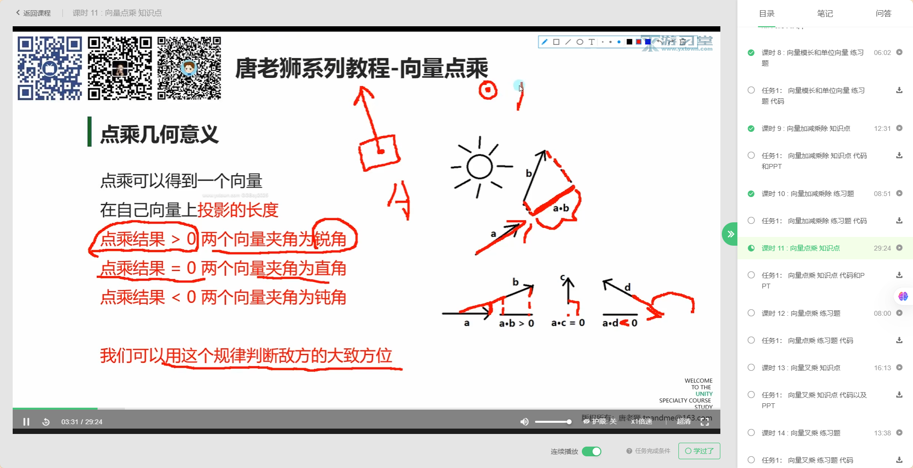

# Mathf

Mathf是Unity中相对System.Math的数学库；

‍

## 常用的方法：

Mathf.Abs()绝对值;

Mathf.PI PI值；

Mathf.Clamp(num,min,max) 夹值；

Mathf.Min();

Mathf.Max();

Mathf.Sqrt() 平方值；

Mathf.IsPowTwo() 是2的平方吗；

Mathf.Pow() 幂；

Mathf.CeilToInt() 向上取整；

Mathf.FloorToInt() 向下取整 ；

Mathf.RoundToInt() 四舍五入；

Mathf.Sign() 判断正负值；

‍

//弧度与角度r

rad = 30 * Mathf.DegToRad

deg = rad * Mathf.RadToDeg;

Mathf.Sin() 正选函数，只支持弧度值

Mathf.Cos();

Mathf.Asin() 反正选函数；

‍

​​

‍
