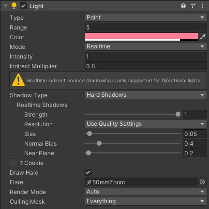
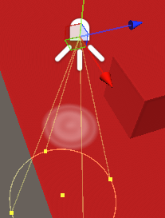
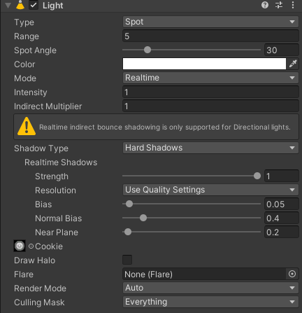

# 光源

光源的分类：

* 		      **Directional 方向光**，带有方向相当于“环境光”，可以模拟太阳光，通过旋转可以模拟日夜更替；
* 		      **Point 点光**， 一个点向外发光，可以用于模拟蜡烛；
* 		     **Spot 聚光灯**，相当于手电筒；
*                       **Area 面光，用得较少；**

‍

## 光源的Inspect：

### 点光：

* 	Type：选择光的类型；
* 	Range:光特效的范围；
* 	Color：颜色；
* 	Intensity：光的强度；
*         Indirect Multiplier: 反射乘数，小于1衰减；
* 	Shadow Type：阴影类型，Sort比Hard好，但消耗性能；
* 	Draw Halo：光晕；
* 	Flare：耀斑材质；
* 	Render Mode：渲染模式；
* 	Culling Mask：剔除掩码；

​​

			

### Spot光：

	Cookie：投影贴图；

​​

	Spot Angle：角度；

​​

‍

‍
