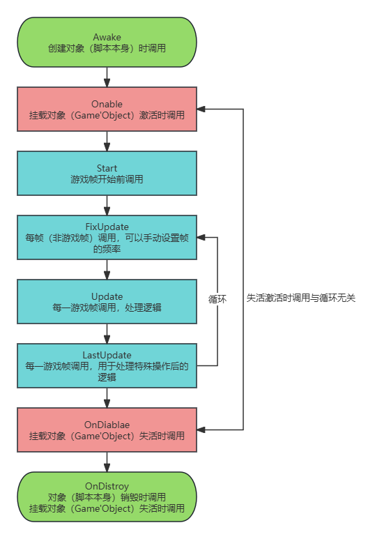

# 生命周期函数

***生命周期函数是继承***​***[MonoBehaviour](https://docs.unity3d.com/Manual/class-MonoBehaviour.html)***​***的脚本类通过***​***[反射](https://learn.microsoft.com/zh-cn/dotnet/fundamentals/reflection/reflection)***​***自动调用的特殊函数，主要包括（***​*((20250303201755-40i0qr7 "Awake"))*​ ***，Onable，Start,***         [FixUpdate](生命周期函数/FixUpdate.md)​ ***,***         ***Update,***         ***LastUpdate,***         ***OnDiable***  *，*​***OnDistroy）***

***生命周期函数支持***​***[继承](https://learn.microsoft.com/zh-cn/dotnet/csharp/fundamentals/object-oriented/inheritance)***​ ***，支持***​***[多态](https://learn.microsoft.com/zh-cn/dotnet/csharp/fundamentals/object-oriented/polymorphism)***​ ***。***

‍

​​

‍

‍

‍

‍

‍
